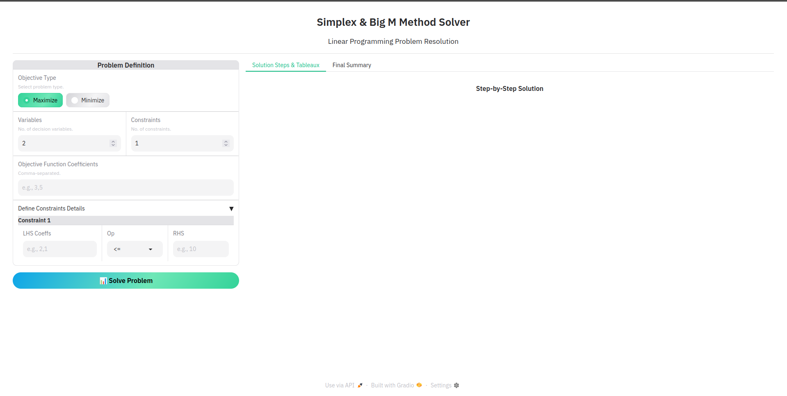
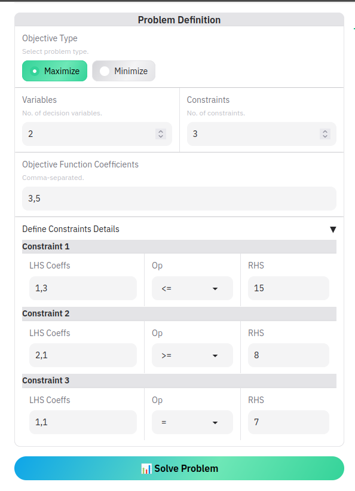
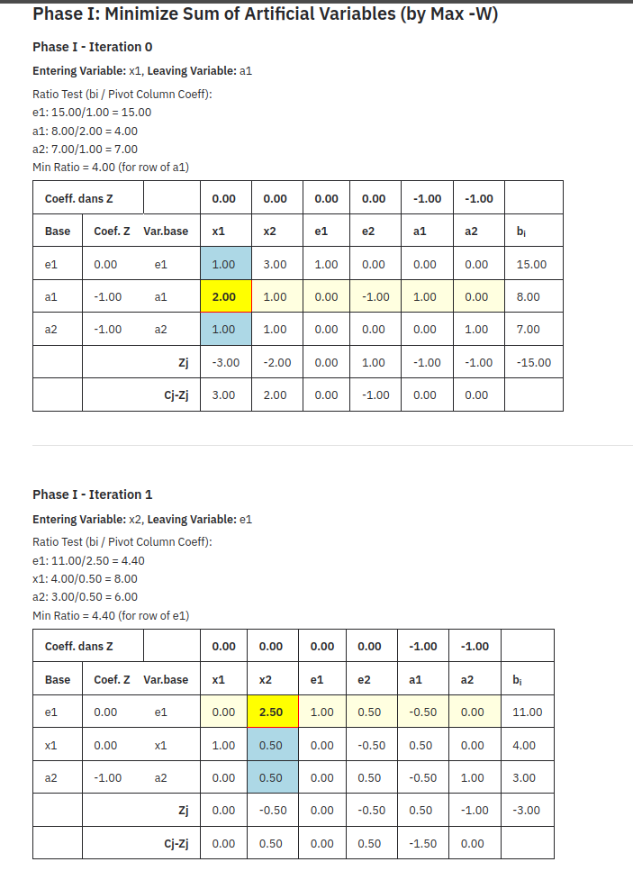
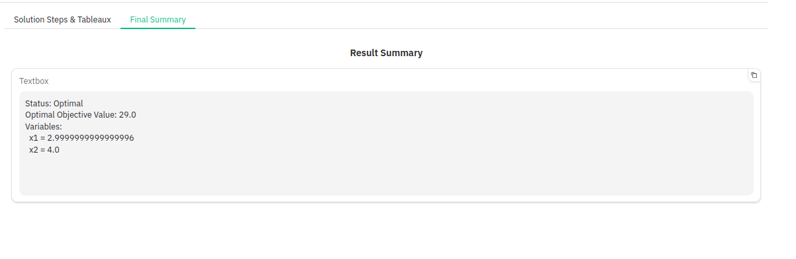
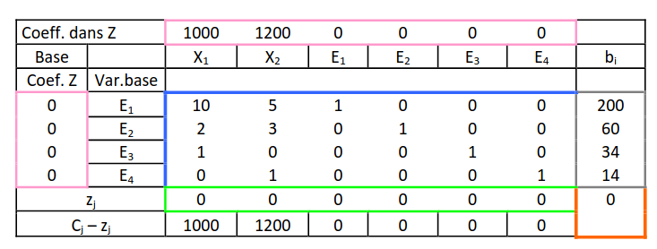

# Solveur de Programmation Linéaire : Méthodes Simplex et Big M

Ce projet est une application web développée avec Python et Gradio pour résoudre des problèmes de programmation linéaire. Il implémente la méthode Simplex standard ainsi que la méthode des Deux Phases (similaire à la méthode Big M) pour gérer tous les types de contraintes (`≤`, `≥`, `=`).

**Date de génération du contexte :** Dimanche 25 Mai 2025, 02:39:26 WAT

<!-- [Capture d'écran de l'interface principale de l'application - `app_main_interface.png`] -->



## Table des Matières

1.  [Introduction](#introduction)
2.  [Fonctionnalités](#fonctionnalités)
3.  [Prérequis](#prérequis)
4.  [Installation](#installation)
5.  [Guide d'Utilisation](#guide-dutilisation)
    - [Définition du Problème](#définition-du-problème)
    - [Lancement de la Résolution](#lancement-de-la-résolution)
    - [Interprétation des Résultats](#interprétation-des-résultats)
6.  [Architecture du Projet](#architecture-du-projet)
    - [Interface Utilisateur (`app.py`)](#interface-utilisateur-apppy)
    - [Logique du Simplex (`simplex_logic.py`)](#logique-du-simplex-simplex_logicpy)
7.  [Méthodologie : Algorithme du Simplex](#méthodologie--algorithme-du-simplex-style)
    - [Mise en Forme Standard](#mise-en-forme-standard)
    - [Tableau du Simplex](#tableau-du-simplex)
    - [Méthode des Deux Phases (pour contraintes `≥` et `=`)](#méthode-des-deux-phases-pour-contraintes--et-)
8.  [Exemples](#exemples)
    - [Problème Standard (PL)](#problème-standard-pl)
    - [Problème avec Méthode des Deux Phases (PG)](#problème-avec-méthode-des-deux-phases-pg)
9.  [Développements Futurs Possibles](#développements-futurs-possibles)

## 1. Introduction

La programmation linéaire (PL) est une technique mathématique d'optimisation permettant de maximiser ou minimiser une fonction objectif linéaire sous un ensemble de contraintes linéaires. Ce solveur a été conçu pour être un outil pédagogique et pratique, affichant clairement chaque étape de l'algorithme du Simplex, y compris les tableaux intermédiaires.

## 2. Fonctionnalités

- Résolution de problèmes de maximisation et de minimisation.
- Gestion des contraintes de type `≤`, `≥`, et `=`.
- Implémentation de la méthode Simplex standard et de la méthode des Deux Phases pour les problèmes nécessitant des variables artificielles.
- Affichage détaillé de chaque tableau du Simplex, incluant :
  - Les coefficients de la fonction objectif (`Cj`).
  - La base actuelle (variables de base et leurs coefficients `Cb`).
  - Les coefficients des contraintes.
  - Les valeurs du membre droit (`bi`).
  - La ligne `Zj`.
  - La ligne critère `Cj - Zj`.
- Identification claire de la variable entrante, de la variable sortante et de l'élément pivot à chaque itération.
- Affichage de la solution optimale (valeurs des variables de décision et de la fonction objectif) ou indication d'infaisabilité/non-bornitude.
- Interface utilisateur web conviviale et responsive construite avec Gradio, utilisant le thème "Ocean".

## 3. Prérequis

- Python 3.7 ou supérieur
- Pip (gestionnaire de paquets Python)

## 4. Installation

1.  **Clonez le dépôt (si applicable) ou copiez les fichiers du projet :**

    ```bash
    # Si c'est un dépôt git
    # git clone <url_du_depot>
    # cd linear-programming
    ```

    Assurez-vous d'avoir les fichiers `app.py`, `simplex_logic.py`, et `requirements.txt` dans le même répertoire.

2.  **Créez un environnement virtuel (recommandé) :**

    ```bash
    python -m venv venv
    ```

    Activez l'environnement :

    - Sous Windows : `venv\Scripts\activate`
    - Sous macOS/Linux : `source venv/bin/activate`

3.  **Installez les dépendances :**
    ```bash
    pip install -r requirements.txt
    ```
    Cela installera Gradio, NumPy, et Pandas.

## 5. Guide d'Utilisation

1.  **Lancez l'application :**
    Ouvrez un terminal dans le répertoire du projet (avec l'environnement virtuel activé) et exécutez :
    ```bash
    python app.py
    ```
2.  **Accédez à l'interface web :**
    L'application sera généralement accessible à l'adresse `http://127.0.0.1:7860` (ou une adresse similaire affichée dans le terminal). Ouvrez cette URL dans votre navigateur web.

    [Capture d'écran de l'interface au démarrage - `app_start_screen.png`]

### Définition du Problème

Le panneau de gauche de l'interface est dédié à la saisie des informations de votre problème de programmation linéaire :



- **Objective Type (Type d'objectif) :** Choisissez "Maximize" (Maximiser) ou "Minimize" (Minimiser).
- **Variables :** Entrez le nombre de variables de décision (ex: `x₁`, `x₂`, ...).
- **Constraints (Contraintes) :** Entrez le nombre de contraintes. Le nombre de champs de saisie pour les contraintes s'ajustera dynamiquement (jusqu'à un maximum de 10).
- **Objective Function Coefficients (Coefficients de la fonction objectif) :** Entrez les coefficients de votre fonction objectif, séparés par des virgules. Par exemple, pour `Z = 3x₁ + 5x₂`, entrez `3,5`.
- **Define Constraints Details (Détails des Contraintes) :** Pour chaque contrainte :
  - **LHS Coeffs (Coeff. du membre gauche) :** Entrez les coefficients des variables pour cette contrainte, séparés par des virgules.
  - **Op (Opérateur) :** Sélectionnez `≤`, `≥`, ou `=`.
  - **RHS (Membre droit) :** Entrez la valeur du membre droit de la contrainte.

### Lancement de la Résolution

Une fois toutes les informations saisies, cliquez sur le bouton "📊 Solve Problem".

### Interprétation des Résultats

Les résultats s'afficheront dans le panneau de droite, divisé en deux onglets :



- **Onglet "Solution Steps & Tableaux" :**
  - Cette section affiche chaque itération de l'algorithme du Simplex sous forme de tableaux.
  - Les informations clés comme la variable entrante, la variable sortante, l'élément pivot et le test du ratio sont indiquées pour chaque étape.
  - Si la méthode des Deux Phases est utilisée (pour les contraintes `≥` ou `=`), les tableaux de la Phase I (minimisation des variables artificielles) et de la Phase II (résolution du problème original) seront distinctement affichés.
- **Onglet "Final Summary" :**

  - Cette section présente un résumé de la solution :
    - **Status :** Optimal, Infeasible (Infaisable), Unbounded (Non borné), ou une erreur.
    - **Optimal Objective Value (Valeur optimale de l'objectif) :** Si une solution optimale est trouvée.
    - **Variables :** Les valeurs des variables de décision à l'optimum.



## 6. Architecture du Projet

Le projet est structuré en deux fichiers Python principaux :

### Interface Utilisateur (`app.py`)

- Construit avec la bibliothèque **Gradio**.
- Définit l'interface utilisateur web, y compris les champs de saisie, les boutons, et les zones d'affichage des résultats.
- Gère les interactions utilisateur et appelle la logique de résolution.
- Formate les données brutes des tableaux (reçues de `simplex_logic.py`) en HTML pour l'affichage.
- Utilise le thème "Ocean" de Gradio pour une esthétique moderne.

### Logique du Simplex (`simplex_logic.py`)

- Contient toute la logique métier pour l'algorithme du Simplex.
- Utilise **NumPy** pour les opérations sur les tableaux (matrices) et **Pandas** pour la structuration et la manipulation des données des tableaux du Simplex.
- Fonctions principales :
  - `standardize_problem` : Convertit le problème de l'utilisateur en forme standard, ajoutant les variables d'écart (`eᵢ` pour `≤`), d'excédent (`eᵢ` pour `≥`), et artificielles (`aᵢ` pour `≥` et `=`).
  - `create_tableau` : Génère un DataFrame Pandas représentant un tableau du Simplex, incluant les calculs de `Zj` et `Cj-Zj`,
  - `find_pivot_column` / `find_pivot_row` : Implémentent les règles de sélection de la variable entrante et sortante.
  - `perform_pivot_operation` : Effectue les opérations de pivotage sur la matrice `A` et le vecteur `b`.
  - `format_tableau_html` : Prend le DataFrame du tableau et le formate en une chaîne HTML stylisée pour un affichage précis .
  - `solve_simplex_problem_style` : Orchestre l'ensemble du processus de résolution, gérant la Phase I (si nécessaire) et la Phase II.

## 7. Méthodologie : Algorithme du Simplex 

L'implémentation suit les étapes classiques de l'algorithme du Simplex, en adaptant la présentation des tableaux .

### Mise en Forme Standard

Avant d'appliquer l'algorithme, le problème est converti :

1.  **Type d'Objectif :** Les problèmes de minimisation (Min Z) sont convertis en problèmes de maximisation (Max -Z).
2.  **Membre Droit (RHS) :** Toutes les valeurs `bᵢ` des contraintes sont rendues non négatives.
3.  **Variables d'Écart (Slack) :** Pour une contrainte `≤`, une variable d'écart `eᵢ ≥ 0` est ajoutée.
    `∑ aᵢⱼxⱼ ≤ bᵢ  =>  ∑ aᵢⱼxⱼ + eᵢ = bᵢ`
4.  **Variables d'Excédent (Surplus) et Artificielles :**
    - Pour une contrainte `≥`, une variable d'excédent `eᵢ ≥ 0` est soustraite et une variable artificielle `aᵢ ≥ 0` est ajoutée.
      `∑ aᵢⱼxⱼ ≥ bᵢ  =>  ∑ aᵢⱼxⱼ - eᵢ + aᵢ = bᵢ`
    - Pour une contrainte `=`, une variable artificielle `aᵢ ≥ 0` est ajoutée.
      `∑ aᵢⱼxⱼ = bᵢ  =>  ∑ aᵢⱼxⱼ + aᵢ = bᵢ`

Les variables d'écart et les variables artificielles (si présentes) forment généralement la base initiale.

### Tableau du Simplex

Le format du tableau affiché s'inspire de celui présenté ci-dessous :



- **Ligne `Coeff. dans Z` :** Coefficients `Cj` de toutes les variables dans la fonction objectif originale (ou modifiée pour la Phase I).
- **Colonne `Base` :** Noms des variables de base actuelles.
- **Colonnes `Coef. Z` et `Var.base` :** Coefficients `Cb` des variables de base dans l'objectif actuel, et répétition du nom de la variable de base.
- **Corps du tableau :** Coefficients `aᵢⱼ` de la matrice des contraintes.
- **Colonne `bᵢ` :** Valeurs actuelles du membre droit.
- **Ligne `Zj` :** Calculée comme `∑ (Cbᵢ * aᵢⱼ)` pour chaque colonne `j`. La valeur `Zj` dans la colonne `bᵢ` est la valeur actuelle de la fonction objectif.
- **Ligne `Cj - Zj` :** Ligne critère, utilisée pour déterminer la variable entrante et vérifier l'optimalité.

### Méthode des Deux Phases (pour contraintes `≥` et `=`)

Lorsque des variables artificielles sont introduites, l'algorithme procède en deux phases :

- **Phase I :**
  - **Objectif :** Minimiser la somme des variables artificielles (`W = ∑ aᵢ`). Dans notre implémentation, nous maximisons `-W = -∑ aᵢ`.
  - Le but est d'obtenir une solution de base admissible pour le problème original en éliminant les variables artificielles de la base (ou en s'assurant qu'elles sont nulles si elles y restent).
  - Si à la fin de la Phase I, `W_min > 0` (c'est-à-dire `-W_max < 0`), le problème original n'a pas de solution admissible (infaisable).
- **Phase II :**
  - Si `W_min = 0`, on utilise le tableau final de la Phase I comme point de départ.
  - Les colonnes des variables artificielles (si elles sont non basiques) sont ignorées.
  - L'objectif original (maximiser Z ou -Z si c'était une minimisation) est utilisé pour calculer la ligne `Cj-Zj`.
  - L'algorithme du Simplex standard est ensuite appliqué.

## 8. Exemples

### Problème Standard (PL)

**Maximiser Z = 10x₁ + 12x₂**
Sujet à :

1.  `10x₁ + 5x₂ ≤ 200`
2.  `2x₁ + 3x₂ ≤ 60`

_(Vous pouvez inclure ici une capture d'écran de la saisie et une du résultat pour cet exemple simple)_

### Problème avec Méthode des Deux Phases (PG)

**Maximiser Z = 3x₁ + 5x₂**
Sujet à :

1.  `x₁ + 3x₂ ≤ 15`
2.  `2x₁ + x₂ ≥ 8`
3.  `x₁ + x₂ = 7`


## 9. Développements Futurs Possibles

- Analyse de sensibilité.
- Résolution de problèmes en nombres entiers (Programmation Linéaire en Nombres Entiers).
- Importation de problèmes depuis des fichiers (ex: format MPS).
- Visualisation graphique des régions admissibles pour les problèmes à 2 variables.
- Amélioration de la gestion des cas de dégénérescence ou de solutions optimales multiples.

---

Ce solveur a été développé dans le but de fournir un outil clair et didactique pour l'apprentissage et l'application de la méthode du Simplex.
