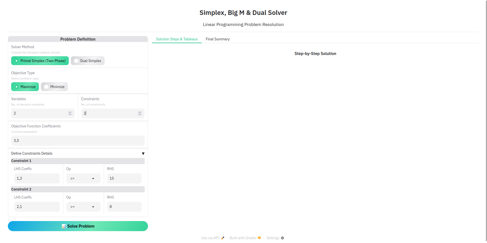

# Solveur de Programmation Linéaire : Méthodes Simplex, Big M et Duale

Ce projet est une application web développée avec Python et Gradio pour résoudre des problèmes de programmation linéaire. Il implémente la méthode Simplex standard, la méthode des Deux Phases (similaire à la méthode Big M) pour gérer tous les types de contraintes (`≤`, `≥`, `=`), ainsi que la **méthode du Simplex Dual**. L'affichage des tableaux du Simplex s'inspire du format HEC Montréal.

**Date de génération du contexte :** Dimanche 25 Mai 2025, 02:39:26 WAT *(Note : README mis à jour pour les fonctionnalités actuelles)*


## Table des Matières

1.  [Introduction](#introduction)
2.  [Fonctionnalités](#fonctionnalités)
3.  [Prérequis](#prérequis)
4.  [Installation](#installation)
5.  [Guide d'Utilisation](#guide-dutilisation)
    *   [Sélection de la Méthode de Résolution](#sélection-de-la-méthode-de-résolution)
    *   [Définition du Problème](#définition-du-problème)
    *   [Lancement de la Résolution](#lancement-de-la-résolution)
    *   [Interprétation des Résultats](#interprétation-des-résultats)
6.  [Architecture du Projet](#architecture-du-projet)
    *   [Interface Utilisateur (`app.py`)](#interface-utilisateur-apppy)
    *   [Logique du Simplex (`simplex_logic.py`)](#logique-du-simplex-simplex_logicpy)
7.  [Méthodologie : Algorithmes du Simplex](#méthodologie--algorithmes-du-simplex)
    *   [Mise en Forme Standard](#mise-en-forme-standard)
    *   [Tableau du Simplex (Style HEC)](#tableau-du-simplex-style-hec)
    *   [Simplex Primal et Méthode des Deux Phases](#simplex-primal-et-méthode-des-deux-phases)
    *   [Méthode du Simplex Dual](#méthode-du-simplex-dual)
8.  [Dualité en Programmation Linéaire](#dualité-en-programmation-linéaire)
    *   [Principe de la Dualité](#principe-de-la-dualité)
    *   [Exemple de Transformation Primal-Dual](#exemple-de-transformation-primal-dual)
9.  [Exemples d'Utilisation](#exemples-dutilisation)
    *   [Problème Standard (Simplex Primal)](#problème-standard-simplex-primal)
    *   [Problème avec Méthode des Deux Phases](#problème-avec-méthode-des-deux-phases)
    *   [Problème pour le Simplex Dual](#problème-pour-le-simplex-dual)
10. [Développements Futurs Possibles](#développements-futurs-possibles)

## 1. Introduction

La programmation linéaire (PL) est une technique mathématique d'optimisation permettant de maximiser ou minimiser une fonction objectif linéaire sous un ensemble de contraintes linéaires. Ce solveur a été conçu pour être un outil pédagogique et pratique, affichant clairement chaque étape des algorithmes du Simplex (Primal, Deux-Phases, Dual), y compris les tableaux intermédiaires, dans un format inspiré de celui de HEC Montréal.

## 2. Fonctionnalités

*   Résolution de problèmes de maximisation et de minimisation.
*   Gestion des contraintes de type `≤`, `≥`, et `=`.
*   **Sélection de la méthode de résolution :**
    *   Simplex Primal (avec Méthode des Deux Phases pour `≥`, `=`).
    *   Simplex Dual.
*   Affichage détaillé de chaque tableau du Simplex (style HEC), incluant :
    *   Les coefficients de la fonction objectif (`Cj`).
    *   La base actuelle (variables de base et leurs coefficients `Cb`).
    *   Les coefficients des contraintes.
    *   Les valeurs du membre droit (`bi`).
    *   La ligne `Zj`.
    *   La ligne critère `Cj - Zj`.
*   Identification claire de la variable entrante, de la variable sortante et de l'élément pivot à chaque itération, adaptée à la méthode choisie.
*   Affichage de la solution optimale (valeurs des variables de décision et de la fonction objectif) ou indication d'infaisabilité/non-bornitude.
*   Interface utilisateur web conviviale et responsive construite avec Gradio, utilisant le thème "Ocean".
*   Explication du concept de dualité avec un exemple.

## 3. Prérequis

*   Python 3.7 ou supérieur
*   Pip (gestionnaire de paquets Python)

## 4. Installation

1.  **Clonez le dépôt :**
    ```bash
    git clone "https://github.com/lado-saha/linear-programming"
    cd linear-programming
    ```
2.  **Créez un environnement virtuel (recommandé) :**
    ```bash
    python -m venv venv
    ```
    Activez l'environnement :
    *   Sous Windows : `venv\Scripts\activate`
    *   Sous macOS/Linux : `source venv/bin/activate`
3.  **Installez les dépendances :**
    ```bash
    pip install -r requirements.txt
    ```
    Cela installera Gradio, NumPy, et Pandas.

## 5. Guide d'Utilisation

1.  **Lancez l'application :**
    ```bash
    python app.py
    ```
2.  **Accédez à l'interface web :**
    Ouvrez l'URL affichée (généralement `http://127.0.0.1:7860`) dans votre navigateur.



### Sélection de la Méthode de Résolution

Avant de définir votre problème, choisissez la méthode de résolution souhaitée :

*   **Solver Method (Méthode de Résolution) :**
    *   **"Primal Simplex (Two-Phase)" :** Méthode standard. La Phase I est automatiquement invoquée si des variables artificielles sont nécessaires (contraintes `≥` ou `=`).
    *   **"Dual Simplex" :** À utiliser lorsque le tableau initial est dual-admissible (ligne `Cj-Zj` "optimale") mais primal-infaisable (certains `bᵢ` négatifs). L'utilisateur doit s'assurer que le problème saisi est formulé de manière appropriée pour un démarrage direct du Simplex Dual.

    <!-- [Capture d'écran du sélecteur de méthode - `app_method_selector.png`] -->
    *(Vous pouvez ajouter une capture d'écran ici si le sélecteur est distinct)*

### Définition du Problème

Le panneau de gauche est dédié à la saisie des informations de votre problème :


*   **Objective Type (Type d'objectif) :** Choisissez "Maximize" (Maximiser) ou "Minimize" (Minimiser).
*   **Variables :** Entrez le nombre de variables de décision (ex: `x₁`, `x₂`, ...).
*   **Constraints (Contraintes) :** Entrez le nombre de contraintes.
*   **Objective Function Coefficients :** Coefficients de votre fonction objectif, séparés par des virgules.
*   **Define Constraints Details :** Pour chaque contrainte :
    *   **LHS Coeffs :** Coefficients des variables, séparés par des virgules.
    *   **Op (Opérateur) :** Sélectionnez `≤`, `≥`, ou `=`.
    *   **RHS (Membre droit) :** Valeur du membre droit.
    *   **Note pour le Simplex Dual :** Pour démarrer le Simplex Dual, il est typique d'avoir des `bᵢ` négatifs. Cela peut provenir de la transformation de contraintes `≥` en `≤` (par multiplication par -1).

### Lancement de la Résolution

Cliquez sur le bouton "📊 Solve Problem".

### Interprétation des Résultats

Les résultats s'affichent dans le panneau de droite, sous deux onglets :


*   **Onglet "Solution Steps & Tableaux" :**
    *   Affiche chaque itération de l'algorithme Simplex choisi.
    *   Les tableaux sont formatés selon le style HEC.
    *   Les variables entrante/sortante, l'élément pivot et le test du ratio (ou équivalent dual) sont indiqués.
    *   Pour le Simplex Primal, les Phases I et II sont distinctement affichées si nécessaire.
*   **Onglet "Final Summary" :**
    *   Résumé de la solution : Statut (Optimal, Infaisable, Non borné), valeur optimale de l'objectif, et valeurs des variables de décision.


## 6. Architecture du Projet

Le projet est structuré en deux fichiers Python principaux :

### Interface Utilisateur (`app.py`)

*   Construit avec **Gradio**.
*   Définit l'interface utilisateur web (saisie, boutons, affichage).
*   Gère les interactions et appelle la logique de résolution.
*   Formate les tableaux en HTML.
*   Utilise le thème "Ocean" de Gradio.

### Logique du Simplex (`simplex_logic.py`)

*   Contient la logique métier pour les algorithmes du Simplex.
*   Utilise **NumPy** pour les opérations matricielles et **Pandas** pour la structuration des tableaux.
*   Fonctions principales :
    *   `standardize_problem` : Met le problème en forme standard, ajoutant variables d'écart (`eᵢ`), d'excédent (`eᵢ`), et artificielles (`aᵢ`). La gestion du signe des `bᵢ` est conditionnelle à la méthode choisie.
    *   `create_hec_tableau` : Génère un DataFrame Pandas pour un tableau Simplex (style HEC).
    *   `find_pivot_column_hec` / `find_pivot_row_hec` : Règles de sélection pour le Simplex Primal.
    *   `find_dual_pivot_row_hec` / `find_dual_pivot_column_hec` : Règles de sélection pour le Simplex Dual.
    *   `perform_pivot_operation_hec` : Opérations de pivotage.
    *   `format_tableau_html_hec` : Formate le DataFrame du tableau en HTML stylisé.
    *   `solve_simplex_main` : Orchestre le processus de résolution, appelant la logique Primal (Deux-Phases) ou Duale.

## 7. Méthodologie : Algorithmes du Simplex

### Mise en Forme Standard

1.  **Objectif :** Min Z est converti en Max -Z.
2.  **RHS `bᵢ` (pour Simplex Primal) :** Rendus non-négatifs (si `bᵢ < 0`, la contrainte est multipliée par -1 et l'inégalité inversée). Pour le Simplex Dual, les `bᵢ` négatifs sont conservés car ils indiquent l'infaisabilité primale initiale.
3.  **Variables d'Écart/Excédent/Artificielles :**
    *   `≤` : `+ eᵢ` (écart)
    *   `≥` : `- eᵢ + aᵢ` (excédent, artificielle)
    *   `=` : `+ aᵢ` (artificielle)

### Tableau du Simplex (Style HEC)

Le format du tableau s'inspire de celui-ci :


*   **Ligne `Coeff. dans Z` :** Coefficients `Cj` de toutes les variables.
*   **Colonne `Base` :** Noms des variables de base.
*   **Colonnes `Coef. Z` et `Var.base` :** Coefficients `Cb` des variables de base dans l'objectif actuel, et nom de la variable de base.
*   **Corps :** Coefficients `aᵢⱼ`.
*   **Colonne `bᵢ` :** Valeurs RHS.
*   **Ligne `Zj` :** `∑ (Cbᵢ * aᵢⱼ)`. `Zj` sous `bᵢ` est la valeur de l'objectif.
*   **Ligne `Cj - Zj` :** Ligne critère.

### Simplex Primal et Méthode des Deux Phases

*   **Phase I (si variables artificielles `aᵢ` présentes) :**
    *   Objectif : Minimiser `W = ∑ aᵢ` (implémenté comme Max `-W`).
    *   But : Obtenir une solution de base admissible pour le problème original.
    *   Si `W_min > 0` à la fin, le problème original est infaisable.
*   **Phase II :**
    *   Utilise le tableau final de la Phase I (avec `W_min = 0`).
    *   L'objectif original est utilisé.
    *   Le Simplex standard est appliqué jusqu'à l'optimalité (`Cj-Zj ≤ 0` pour Max) ou la détection d'une solution non bornée.
*   **Critères de pivot (Max Z) :**
    *   Variable Entrante : Colonne avec le plus grand `Cj-Zj > 0`.
    *   Variable Sortante : Ligne avec le plus petit ratio `bᵢ / aᵢₖ > 0` (où `k` est la colonne pivot).

### Méthode du Simplex Dual

*   **Condition de départ :** Le tableau doit être dual-admissible (ex: `Cj-Zj ≤ 0` pour Max Z) mais primal-infaisable (au moins un `bᵢ < 0` pour une variable de base).
*   **Objectif :** Atteindre la faisabilité primale tout en maintenant la faisabilité duale.
*   **Critères de pivot (Max Z, `Cj-Zj ≤ 0` maintenu) :**
    *   Variable Sortante (Ligne Pivot `r`) : Ligne avec le `bᵣ` le plus négatif. Si tous les `bᵢ ≥ 0`, la solution est optimale.
    *   Variable Entrante (Colonne Pivot `k`) : Parmi les `aᵣⱼ < 0` dans la ligne pivot `r`, choisir la colonne `k` qui minimise `| (Cj-Zj)ⱼ / aᵣⱼ |`. Si tous les `aᵣⱼ ≥ 0` dans la ligne pivot, le problème primal est infaisable (dual non borné).

## 8. Dualité en Programmation Linéaire

### Principe de la Dualité

À chaque problème de programmation linéaire (appelé **problème primal P**), on peut associer un autre problème de programmation linéaire, appelé son **problème dual D**. La résolution de l'un fournit des informations directes sur la solution de l'autre. Leurs valeurs optimales, si elles existent, sont égales.

### Exemple de Transformation Primal-Dual

**Problème Primal (P) :**
Maximiser `Z = 3x₁ + 5x₂`
Sujet à :
1.  `x₁ + 3x₂ ≤ 15`
2.  `2x₁ + x₂ ≥ 8`
3.  `x₁ + x₂ = 7`
`x₁, x₂ ≥ 0`

**Problème Dual (D) correspondant :**
Soient `y₁, y₂, y₃` les variables duales.
Minimiser `W = 15y₁ - 8y₂ + 7y₃`  *(après avoir transformé la contrainte 2 du primal en `-2x₁ - x₂ ≤ -8` pour la dérivation)*
Sujet à :
1.  `y₁ - 2y₂ + y₃ ≥ 3`
2.  `3y₁ - y₂ + y₃ ≥ 5`
`y₁ ≥ 0`
`y₂ ≥ 0`
`y₃` est non restreinte en signe (URS - Unrestricted in Sign), car la contrainte 3 du primal est une égalité.

*(Note : La transformation exacte du primal pour dériver le dual peut varier légèrement selon les conventions, notamment pour les contraintes `≥` et `=`. L'exemple ci-dessus suit une approche commune.)*

## 9. Exemples d'Utilisation

### Problème Standard (Simplex Primal)
**Maximiser Z = 10x₁ + 12x₂**
Sujet à : `10x₁ + 5x₂ ≤ 200`, `2x₁ + 3x₂ ≤ 60`.

### Problème avec Méthode des Deux Phases
**Maximiser Z = 3x₁ + 5x₂**
Sujet à : `x₁ + 3x₂ ≤ 15`, `2x₁ + x₂ ≥ 8`, `x₁ + x₂ = 7`.

### Problème pour le Simplex Dual
**Maximiser Z = -2x₁ - x₂** (Minimiser `2x₁ + x₂`)
Sujet à (après transformation pour tableau dual-admissible initial) :
1.  `-3x₁ - x₂ ≤ -3`  (original : `3x₁ + x₂ ≥ 3`)
2.  `-4x₁ - 3x₂ ≤ -6` (original : `4x₁ + 3x₂ ≥ 6`)

*(Pour ces exemples, vous pouvez ajouter des captures d'écran de l'application montrant la saisie et les résultats.)*

## 10. Développements Futurs Possibles

*   Analyse de sensibilité.
*   Résolution de problèmes en nombres entiers.
*   Importation/Exportation de problèmes (ex: format MPS, CSV).
*   Visualisation graphique (pour 2 variables).
*   Gestion avancée de la dégénérescence.

---

Ce solveur a été développé dans le but de fournir un outil clair et didactique pour l'apprentissage et l'application des méthodes du Simplex.
